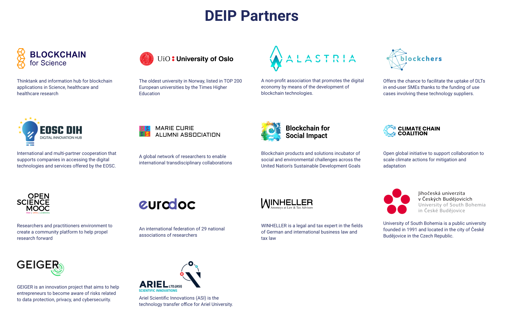

# Getting started


Our documentation space has four main sections:   
- [Learn](https://docs.deip.world/learn) \(for learners\)  
- [Build](https://docs.deip.world/build) \(for people who want to build a Portal\)  
- [Develop](develop/development-introduction.md) \(for people who want to develop DEIP technologies\)  
- [Use cases](https://docs.deip.world/deip-network) \(examples of DEIP implementation in real business environments\)


## What is DEIP? 

DEIP focuses on the creative industries to create the most advanced decentralized protocol for the creator economy. We are making a foundational infrastructure to unlock the full potential of creators around the world.

DEIP technologies are built to drive the adoption of Web 3.0 technologies for creative economy use cases and boost the liquidity of intangible assets. We are working to maximize the realization of global human and intellectual capital. 

DEIP is a rapidly growing ecosystem that provides a set of technologies, tools, and strategies for tokenization and governance of high-value intangible assets. Using our modular, open-source constructor, you can build your own business based on DEIP distributed technologies. 



## Why DEIP?

The world is shifting from a “value-capturing” economy to a “value-creation” economy and needs a new set of rules, which democratize access to resources for creators and make value creation as rewarding as it should be in the 21st century.

We believe that soon most resources other than intellectual and human capital will become commodities. As a producer of knowledge-based assets, creative industries will become the leading drivers of economic growth in the world. 


The creator economy is defined as the class of businesses built by over 50 million independent content creators, curators, and community builders. It includes social media influencers, bloggers, and videographers, plus the software and finance tools designed to help them with growth and monetization.  
[Read more](https://signalfire.com/blog/creator-economy/)


We have created **the first Web 3.0 Creator Economy Protocol** and a colossal ecosystem that provides a solution to the main problems of Web 2.0 for creator economy participants by:

* Increasing the liquidity of high-value intangible assets
* Protecting intellectual property
* Facilitating collaboration between creators and business
* Providing a governance model framework for the appraisal of assets
* Creating a transparent reward mechanism for creators

The focus of the DEIP protocol is to bring together creator-economy players from around the world in a **decentralized, independent ecosystem**. Here, each branch of the creators economy will find all the necessary tools to create and operate its businesses. 

### Ecosystem

In cooperation with the Polkadot Parity substrate and DEIP partners, who have already transferred their businesses from Web 2.0 to a Web 3.0 space, a colossal ecosystem is being formed. Behind the scenes of the ecosystem is [Collective Intelligence Labs](https://www.crunchbase.com/organization/collective-intelligence-labs). Collective Intelligence Labs is ****a group of devs, architects, researchers and designers: [people](https://www.deip.world/team), who are working on technologies for decentralized decision making.

DEIP infrastructure is based on **Polkadot Parity substrate**, supported by **a Web3 Foundation grants program** and strong partnerships with universities, investors, and associations:


DEIP has successfully applied for a Web3 grant that can be found in the [accepted grant applications](https://github.com/w3f/General-Grants-Program/blob/master/grants/accepted_grant_applications.md) list. 


## How does DEIP work?

DEIP's Creator Economy Protocol is a Web 3.0, domain-specific protocol for intangible assets and derivatives. The protocol enables the discovery, evaluation, licensing, and exchange of intangible assets. It is designed specifically for intangible asset tokenization \([F-NFT](learn/protocol/tokenized-intangible-assets-f-nfts.md)\), [governance ](learn/governance.md)\(via DAO\), and [liquidity](learn/protocol/dynamic-liquidity-protocol.md) \(via DeFi instruments and derivatives\). 

The Creator Economy Protocol serves as the base protocol for multiple specific protocols implemented on top of it:  [Dynamic Liquidity Protocol](learn/protocol/dynamic-liquidity-protocol.md), [Intangible Assets Yield Farming Protocol](learn/protocol/yield-farming.md), [Collective Intelligence Protocol](learn/protocol/collective-intelligence-protocol/). 

Using our [modular open-source constructo](https://app.gitbook.com/@deip-world/s/deip-documentation/~/drafts/-MhJyrMXmkHjOZN58gJx/build/build-introduction)[r](https://app.gitbook.com/@deip-world/s/deip-documentation/~/drafts/-MhJyrMXmkHjOZN58gJx/build/build-introduction) based on DEIP's blockchain protocol, you can build your own business that will be part of the DEIP Network. DEIP Network is expanding, and we want to introduce you to existing businesses \(portals\) built on DEIP Technologies:


Find out all existing businesses \(portals\) built on DEIP Technologies in the [DEIP Use cases](https://docs.deip.world/deip-network) section.


## Getting Started

Before you start we recommend you learn how blockchain works: 

* The [Blockchain Fundamentals MOOC course](https://mooc.web3.foundation/course/blockchain-fundamentals/) developed by Web3 Foundation is a great introduction to blockchain concepts such as cryptography and networks, and how these play into things like decentralization and cryptocurrency. 

Thе course will be useful for both blockchain beginners and for those who need to refresh their knowledge.

### DEIP for beginners

DEIP's documentation space consists of several modules:

* [Learn](https://docs.deip.world/learn) - Everything you should know about DEIP's infrastructure and its components: [Protocol](learn/protocol/), [Network](learn/network.md), [Token](learn/token.md), [Governance](learn/governance.md), [Constructor](learn/constructor.md), and [Portals](learn/portals.md). You can also read our detailed [Whitepaper](https://docsend.com/view/nx375c2v85g2rk6c). 
* [Build](https://docs.deip.world/build) - Here, you will be able to find the most up-to-date information on portal-building tools. ****Also, we hope that you will find our [GitHub repository](https://github.com/DEIPworld/deip-polkadot) helpful. 
* [Develop ](develop/development-introduction.md)- Here you will find information and guides to develop DEIP technologies. 
* [Use cases](https://deip-world.gitbook.io/deip-prototype/deip-network) - Learn about the businesses already built using DEIP blockchain technologies and which are part of the DEIP network.

