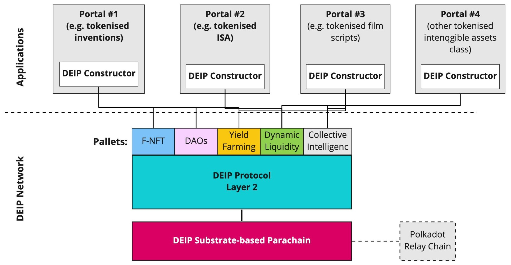

# Build Introduction

## What is DEIP Constructor? 

DEIP provides tools and instruments to implement DEIP technologies into your idea and build your own project in the Web 3.0 space. DEIP Constructor is a modular, open-source framework and its main aims are

* To drive adoption of DEIP infrastructure
* Help gather tokenized intangible assets in the network
* Boost internal economic activity 

DEIP Constructor can be used in two modes to build a Portal: [**no-code mode**](no-code-constructor.md) ****and [**low-code mode**](low-code.md). 


The no-code Constructor has been called "WordPress for Web 3.0" due to it being simple to use and how it will foster the development of Web 3.0 . The no-code Constructor will be announced soon.  


### Constructor structure

The DEIP Constructor accelerates adoption of DEIP application-specific protocols. It is not limited to just one chain and is designed to be layer-1 agnostic. For any layer-1 chain, it’s possible to implement an adapter and use the DEIP Constructor for building Web3 applications for other layer-1 chains. 

The DEIP Constructor implements adaptors for the Substrate-based chain implementation of the DEIP Protocol and for the DEIP Hybrid Blockchain \(a purpose-built layer-1 that runs the DEIP testnet\).

### No-code mode

A no-code mode constructor does not require technical knowledge and programming skills, and in this mode you build Portals using drag-n-drop UI modules.


 The no-code Constructor will be announced soon.  


### Low-code mode

The low-code mode Constructor is a free, open-source tool that helps developers build their applications \(i.e. [Portals](../learn/portals.md)\) in the DEIP Network. This tool requires basic programming skills because you build portals by assembling ready-made software modules.


Find out more on how to get started with the low-code mode Constructor: [low-code Constructor](low-code.md), [GitHub](https://github.com/DEIPworld/deip-modules). 


