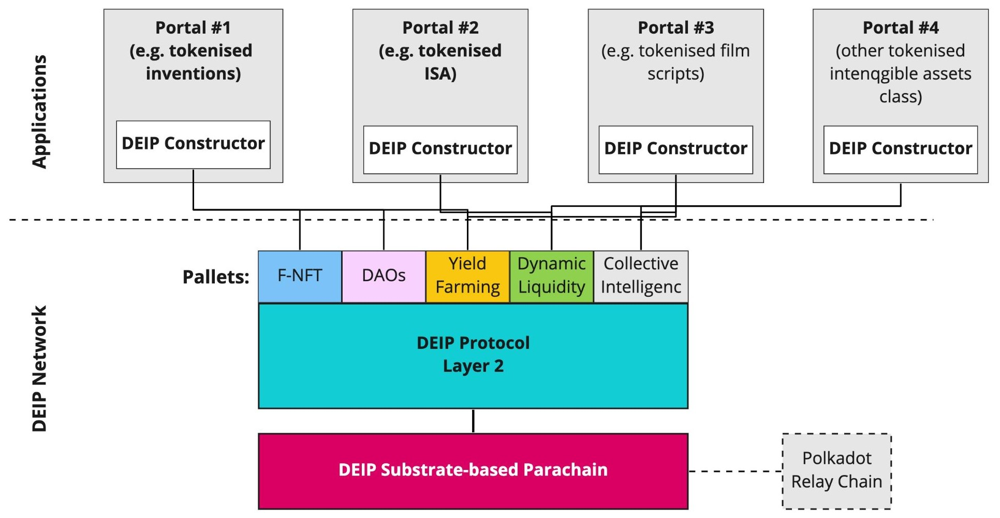

# Constructor

## DEIP Constructor

The main aim of the DEIP Constructor is to drive the adoption of the DEIP Network and help gather tokenized intangible assets in the network and therefore boost internal economic activity. The DEIP Constructor is a modular open-source framework to build intangible assets-centric Web3 platforms in a short time and launch them in DEIP Network. The DEIP Constructor can operate in no-code or low-code modes.

## No-Code mode

Use admin panel and setup wizard. Customised UI with drag-and-drop functionality. Integrate existing modules like F-NFT, DeFi, Funding, Licensing, DAO, etc. In future third party modules will be provided by other Polkadot projects, and will be able to install as a Pallet.

## Low-code mode

Use WASM and Rust to build custom modules. Customised existing modules by digging deeper into the code. In future we will also provide our own DSL and Workflow builder. Open API for integration with third-party services.

## Blockchain agnostic architecture

The DEIP Constructor accelerates the adoption of the DEIP application-specific protocol. It is not limited to just one chain and is designed to be layer-1 agnostic. For any layer-1 chain, it’s possible to implement an adapter and use the DEIP Constructor for building Web3 applications for other layer-1 chains. 

The DEIP Constructor implements adaptors for the Polkadot Substrate-based implementation of the DEIP Protocol and for the DEIP Hybrid Blockchain \(a purpose-built layer-1 that runs the DEIP test-net\).

