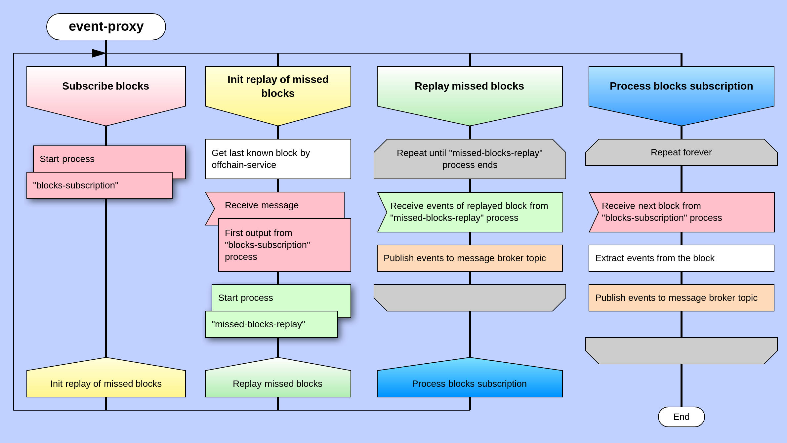

# Event-proxy module. Kafka Streaming

## Introduction

DEIP developed the Event-Proxy module to notify the outside world of changes in the state of the DEIP blockchain. It is the basement of capturing data in real-time, so that the right information is at the right place, at the right time.

The Event-Proxy module is an application that uses a network RPC-API Substrate framework to receive and extract data from blocks. 

The module generates events form obtained data. In order for the application to obtain the necessary data for event generation, it is necessary to perform external write operations \(extrinsic\) and protocol operations \(smart-contract\).


The Event-Proxy module is based on the canon of the Actor Model in Rust, and adheres to the principles of Event-Driven design. It uses the Apache Kafka streaming platform for events sending.


## Events structure 

There are 2 main types of events in the DEIP system: **Domain** and **Infrastructure** events. 

#### Domain events 

The first type is most attractive for subscribers because it reflects changes in the domain model and forms an event-driven change chain for business processes. 

In case of successful execution, all external changes, represented by Substrate-type "extrinsic", emit a characteristic domain event. Examples of such events include `AssetCreatedEvent`, `ContractAgreementSignedEvent`, `DaoMembershipChangedEvent` and others.

In addition, the protocol may notify a subscriber itself of an internal change that has occurred as a result of a satisfying condition \(for example, at a certain time\). An example of such an event is `CrowdfundingFinishedEvent`.

#### Infrastructure events 

This type supports the serviceability of the DEIP system as defined by its technical features. An example of such an event is `BlockCreatedEvent`.

The system sends events to the Apache Kafka channel \(topic/partition\) in JSON format according to the structure:

```bash
{
  name,
  type,
  data,
  meta
}
```

Each event has a name, type, payload and metadata.


Each event has a link to the block in which it occurred. This will make it possible to cancel the event in case of network forking. In addition, events can be grouped into different channels, which allows distributing the load on event handling \(sharding per portal app\)


## 

## Architecture 





Becoming a super hero is a fairly straight forward process:

```
$ give me super-powers
```


 Super-powers are granted randomly so please submit an issue if you're not happy with yours.


Once you're strong enough, save the world:


```bash
# Ain't no code for that yet, sorry
echo 'You got to trust me on this, I saved the world'
```



