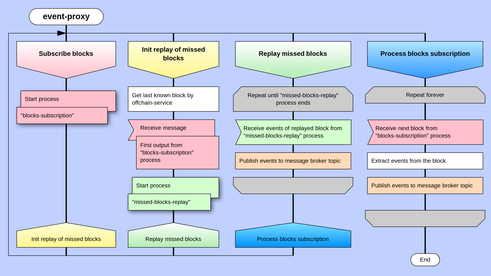

# Event-Proxy module

## Introduction

DEIP developed the Event-Proxy module to notify the outside world of changes in the state of the DEIP blockchain. It is the basement of capturing data in real-time, so that the right information is at the right place and at the right time.

The Event-Proxy module is an application that uses a network RPC-API Substrate framework to receive and extract data from blocks. 

The module generates events from obtained data. In order for the application to obtain the necessary data for event generation, it is necessary to perform external write operations \(extrinsic\) and protocol operations \(smart contract\).


The Event-Proxy module is based on the canon of the Actor Model with [the Rust programming language](https://www.rust-lang.org/), and adheres to the principles of [Event-Driven design](https://www.redhat.com/en/topics/integration/what-is-event-driven-architecture). It uses [the Apache Kafka streaming platform](https://kafka.apache.org/documentation/streams/) for events sending.


## Events structure 

There are 2 main types of events in the DEIP system: **Domain** and **Infrastructure** events. 

#### Domain events 

The first type is the most attractive for [systems-subscribers](event-proxy-module.md#event-proxy-subscribers) because it reflects changes in the domain model and forms an event-driven change chain for business processes. 

In case of successful execution, all external changes, represented by Substrate-type "extrinsic", emit a characteristic domain event. Examples of such events include `AssetCreatedEvent`, `ContractAgreementSignedEvent`, `DaoMembershipChangedEvent`, and others.

Moreover, the protocol itself may notify a system-subscriber of an internal change that has occurred as a result of a satisfying condition \(for example, at a certain time\). An example of such an event is `CrowdfundingFinishedEvent`.

#### Infrastructure events 

This type supports the serviceability of the DEIP system as defined by its technical features. An example of such an event is `BlockCreatedEvent`.

The system sends events to a [Kafka topic partition](https://kafka.apache.org/28/documentation/streams/architecture#streams_architecture_tasks) in JSON format according to the structure:



```javascript
{
  name,
  type,
  data,
  meta
}
```




Each event has a name, type, payload, metadata, and link to the block in which it occurred. This will allow to cancel the event in case of network forking. In addition, events can be grouped into different channels, which allows you to distribute the load on event handling \(sharding per portal/app\)


## Event-Proxy properties

#### The "Replay" process 

The Event-Proxy module is able to override blocks, which is called the "Replay" process in Event-Sourcing architectures. This process allows a subscriber to receive an event stream starting at any point in the network history. 

In addition, the system automatically triggers the "Replay" process when the Event-Proxy started. It allows you to prevent the loss of events that have occurred during node downtime \(**the missed-blocks-replay process**\). To do this, a subscriber must provide the ID of the last block that is processed \(`last_known_block`\).

#### Fault-tolerance

The Actor model architecture of the Event-Proxy provides **fault tolerance** so that possible errors are treated as part of the normal behavior of the system \(for example, disconnection, invariant violations, etc.\). Its implementation is based on competitive task-queues processing. The system considers each action as a task \(the last block request, reaction to an error, etc.\) and allocates a separate queue for each type of task. 

## Architecture 

The Event-Proxy module defines several main systems-participators, abstracted by the actor model: **"BlockchainActor"**_,_ **"OffchainActor"**, __and **"MessageBrokerActor"**_._ 

The system interacts with actors by a special type of task `actor_task`. The communication between actors is based on the Event-Driven architecture principles, where behavior and the next steps depend on the result of the previous step. 

So that reaction to errors and the expected behavior are embedded in the system design, it allows processes to reinitiate if they fail.



The short Event-Proxy process algorithm consists of the following steps:

1. Start, initialize, __and read configuration file
2. Get last-known block from a subscriber \(`last_known_block`\)
3. Subscribe to new blocks
4. Get current block from subscription \(`head_block`\)
5. Start **a missed-blocks-replay process**, i.e. iteration from `last_known_block` to `head_block` and publication of missed events
6. Process all next blocks received from subscription and publish new events

### Event-Proxy Subscribers

The Event-Proxy module provides a great opportunity to build third-party applications. 

_**Which applications can subscribe to the Event-Proxy module?**_ 

All applications that can read the event stream from a Kafka topic partition can subscribe to the Event-Proxy module, for example: 

* Indexers for search optimization
* ML/AI modules for constructing various analytical models
* Web servers for providing third-party services
* Other applications. 

In addition, the Event-Proxy module separates writing and reading models. That function increases network bandwidth by: 

* Reducing the amount of data sent for recording
* Reducing the overall volume of the transaction log 
* Concentrating the blockchain protocol solely on business process validation

On the other hand, an event-oriented interface allows you to build off-chain infrastructure for storing, processing, and rearranging read models intended for displaying to end users in the desired format.

