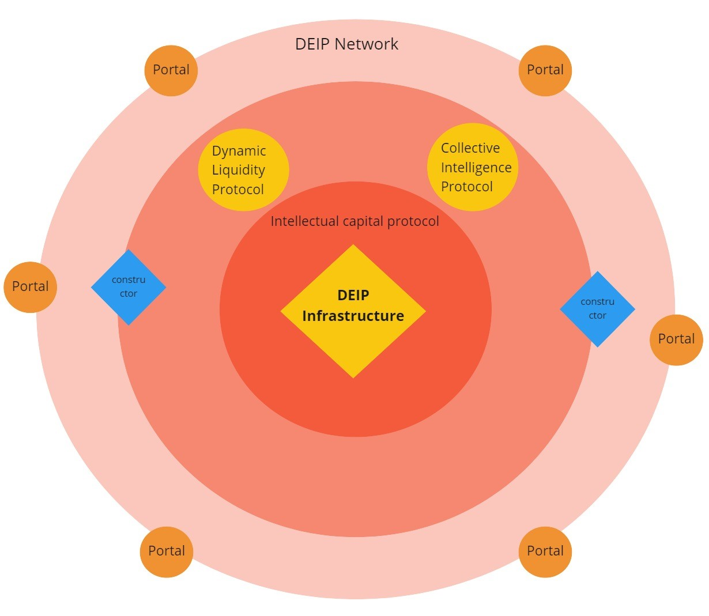

# DEIP Infrastructure

DEIP Infrastructure is an application-specific Substrate 3.0 based Polkadot Parachain that implements a number of protocols and tools for the creative economy. DEIP Infrastructure is a broad framework based on Intellectual Capital Protocol to create your own products and drive adoption of Web3 space in general. 

## What is DEIP Infrastructure? 

DEIP Infrastructure provide group of DEIP protocols that are designed to build your own products \(DEIP Portal\) on the DEIP network:

The group of protocols in the infrastructure is based on the main Intellectual Capital Protocol. 


Intellectual Capital Protocol is a decentralized protocol that enables discovering, evaluation, licensing, and exchange of intangible assets. It is designed specifically for intangible assets tokenization \(as F-NFT\), governance \(via DAO\), and liquidity \(via DeFi instruments and derivatives\).


### How DEIP Technologies can be used? 

DEIP provide tools and instruments to implement DEIP technologies into your idea and build your own project in Web3 space. The main aim of the DEIP Constructor is to drive the adoption of the DEIP Infrastruction and help gather tokenized intangible assets in the network and therefore boost internal economic activity. 


The DEIP Constructor is a modular open-source framework to build intangible assets-centric Web3 platforms in a short time and launch them in DEIP Network. The DEIP Constructor can operate in no-code or low-code modes. 


🔍Learn more about how to build your project in DEIP Infrastructure here:



