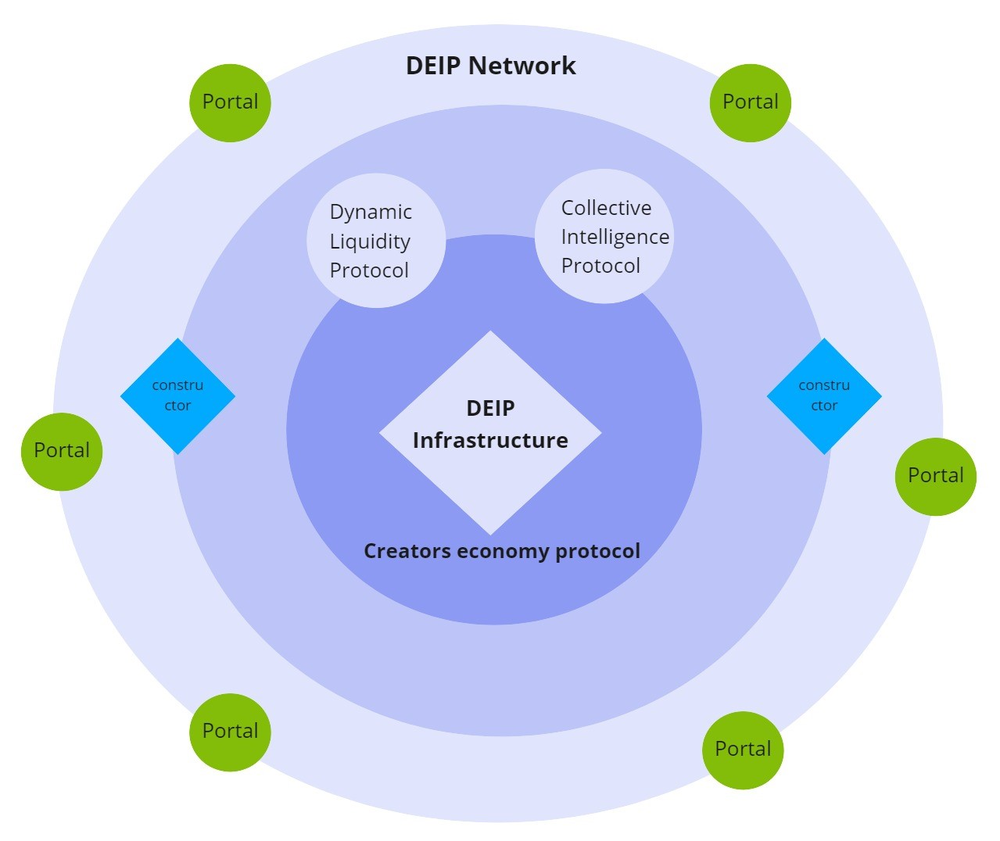

# Infrastructure overview

DEIP infrastructure implements a number of protocols and tools for the creative economy. DEIP infrastructure is a broad framework based on Creator Economy Protocol to build your own projects and drive adoption of Web 3.0. 

## What is DEIP infrastructure? 

DEIP infrastructure provides a group of DEIP protocols that are frameworks designed to help you build your own products \(DEIP Portals\) on the DEIP Network:

### Protocols

The Creator Economy Protocol is the fundamental protocol of DEIP infrastructure. It represents a set of operations that act like building blocks to compose solutions for Portal-specific services. 


The Creator Economy Protocol is a decentralized protocol that enables the discovery, evaluation, licensing, and exchange of intangible assets. It is designed specifically for [intangible assets tokenization](protocol/tokenized-intangible-assets-f-nfts.md) \(as F-NFT\), [governance](governance.md) \(via DAO\), and [liquidity](protocol/dynamic-liquidity-protocol.md) \(via DeFi instruments and derivatives\).


On top of the main Creator Economy Protocol is a group of protocols: [Dynamic Liquidity Protocol](protocol/dynamic-liquidity-protocol.md), [Intangible Assets Yield Farming Protocol](protocol/yield-farming.md), [Collective Intelligence Protocol](protocol/collective-intelligence-protocol/). 


Find out more about DEIP Protocols here: [Creators Economy Protocol](protocol/). 


### Network

DEIP Network is an open-source network of [Portals](portals.md) \(projects, businesses\) that are built using DEIP technologies. Anyone is welcome to create their own portal, which should have a specific intellectual theme to it.

**Portals** are gateways to the DEIP Infrastructure and provide all the necessary functionality \(e.g. user interface, off-chain data, regulation compliance, KYC/AML\) and services required to interact with the network.


Find out more about DEIP [Network](network.md) and [Portals](portals.md).


In order to simplify the creation of Portals and bring about further collaboration in the Web 3.0 environment, DEIP has created a special constructor.

### Constructor

DEIP provides tools and instruments to implement DEIP technologies into your idea and build your own project in Web 3.0 space. DEIP Constructor is a modular, open-source framework. The main aim of the DEIP Constructor is to drive the adoption of the DEIP infrastructure and help gather tokenized, intangible assets in the network to boost internal economic activity. 

DEIP Constructor can be used in [**no-code**](../build/no-code-constructor.md) ****and  [**Low-code** ](../build/low-code.md)mode. 


Learn more about how to build your project with DEIP [Constructor](constructor.md). 


### Governance

Due to its decentralized nature, blockchain protocols typically have no central governing entity. DEIP created a decentralized governance model with DEIP Council at its head. Members of the council are appointed depending on participation in an auction or the takeover of a council seat. Members govern an ecosystem fund which is used to facilitate the development of the DEIP Network by distributing funds to be invested in the network.

Moreover, the DEIP Council will preside over any decisions to alter the governance model and other aspects of the DEIP Network.


Learn more about DEIP [Governance](governance.md). 


