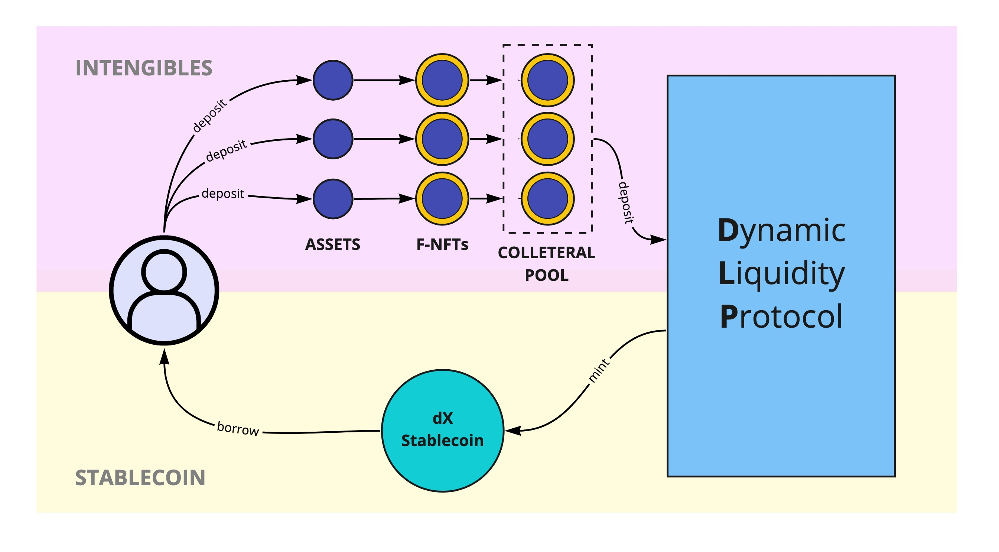
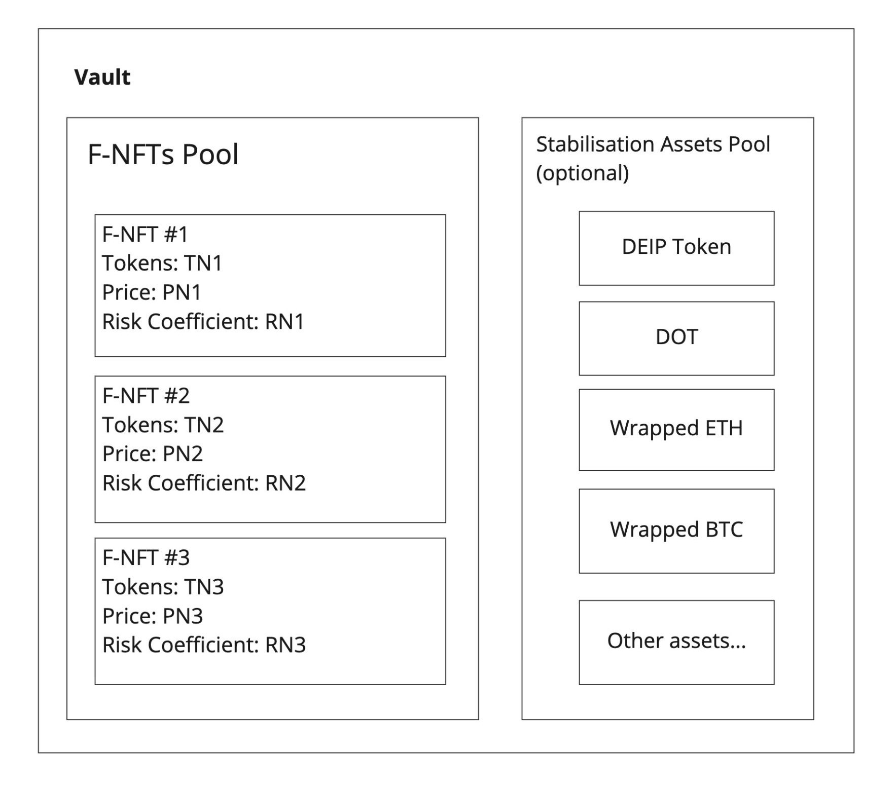
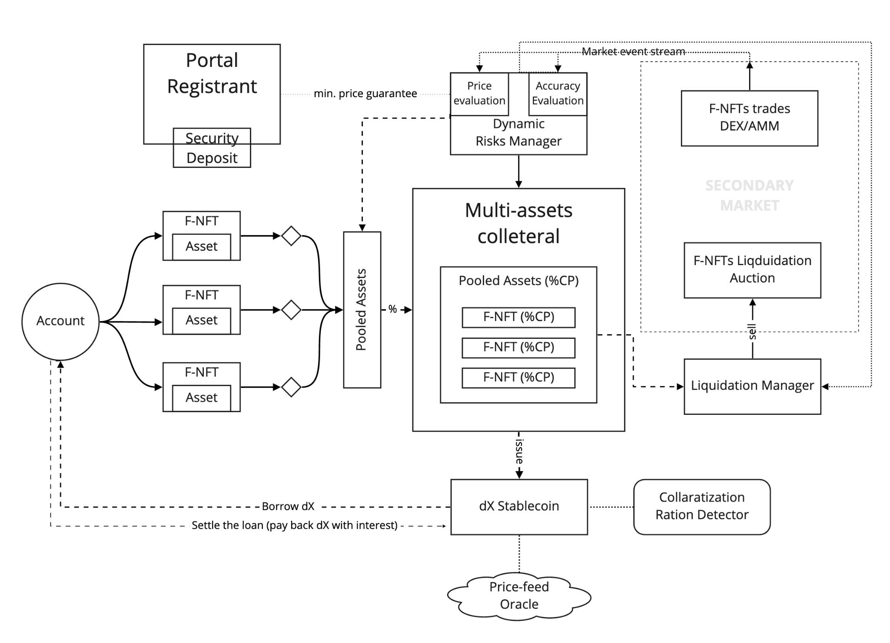

# Dynamic Liquidity Protocol

The **Dynamic Liquidity Protocol** provides additional liquidity mechanisms for intangible assets. It allows borrowing a **dX stablecoin** from the protocol in exchange for tokenized intangible assets locked as collateral. 


dX is a decentralized multi-collateral backed stablecoin with F-NFT as underlying assets and is soft-pegged to a fiat currency.


The price of fiat currency is provided to the network via price feeds coming from the Chainlink oracles\).

## Stablecoin dX in DEIP Infrastructure

In the DEIP Infrastructure, anyone can mint **a stable token dX** \(e.g. dUSD, dEUR, dCYN, etc.\) by collateralizing F-NFTs and locking them into a special smart contract \(**Vault**\). 

In order to mint **X amount** of stable tokens, the total value $$C_{total}$$ of assets locked into the collateral smart contract has to be $$C_{total}=\lambda KX$$ , where **K** is the default collateralization coefficient and $$\lambda$$ is dynamic adjustment coefficient. 


The default collateralization coefficient is K=3 \(300% of the locked underlying assets value\), therefore to borrow 1M dUSD tokens the borrower has to put $3M of the value of F-NFT tokens as collateral to a Vault. 


The actual collateralization coefficient is adjusted **dynamically** \(via component\) and can change over time taking into account recent transactions with F-NFTs, F-NFT issuer track record, issuance platform, recent licensing transactions, and payouts of a specific F-NFT from the collateralization bucket. 

To withdraw the assets from a Vault smart contract the borrower needs to settle/pay the full amount of borrowed **dX tokens** plus **a stability fee** \(**interest rate**\). Stability fee is paid to the network and distributed 50/50 between yield farmers and Ecosystem Fund. The stability fee is set via the network governance mechanism.

## Liquidation Auction

To ensure there is always enough collateral to cover the value of all outstanding debt \(the amount of dX outstanding\), any Vault deemed too risky \(according to parameters established by the DEIP Infrastructure\) is liquidated through an **automated liquidation auction**. 

### How it works?

The Dynamic Liquidity Protocol makes the determination after comparing the **Liquidation Ratio** to the current collateral-to-debt ratio of a Vault. 


Each Vault has its own Liquidation Ratio based on the assets stored in it and the risk profile of the particular collateral asset type. 


Once liquidation auction is triggered, a special liquidation smart contract takes a percentage of the assets pool \(F-NFTs pool\) in the Vault and puts it on auction, separately it puts assets from the **Stabilization assets pool** on the liquidation auction. 

From the F-NFTs pool, the protocol takes a percentage of the pool \(determined by risk-assessment smart contract based on the currency governance configuration\) and splits it into two auction slots of two different types: “**pooled**” and “**segregated**”. 

* **Pooled slots** contain a percentage of all the assets from Vault F-NFTs pool into a single slot, and in case it’s bought it provides immediate price discovery for the Vault F-NFTs assets. 
* **Segregated slots** are created for each N-NFT in the Vault. 

The percentage is the same for each F-NFT and determined by liquidation smart contract based on current on-chain governance settings. 

Segregated slots give more accurate price discovery, but take more time to be liquidated on the market. Once the liquidation is performed, the liquidation smart contract estimates the new price of assets in the Vault and the risk coefficients. In case the total weighted value of the Vault is greater than the value of borrowed assets multiplied by the collateralization coefficient, it stops the liquidation process, if not - it launches the next iteration and does the whole process again, this time with a bigger share of Vault assets. 

The percentage of each **liquidation iteration** $$pl_n$$ is: 

$$
pl_n = \varpi * pl_{n-1} = \varpi^n * pl_0
$$

, where $$ϖ$$ is liquidation step multiplication coefficients, $$pl_0$$ is a default liquidation percentage, both set by the on-chain governance mechanisms.

