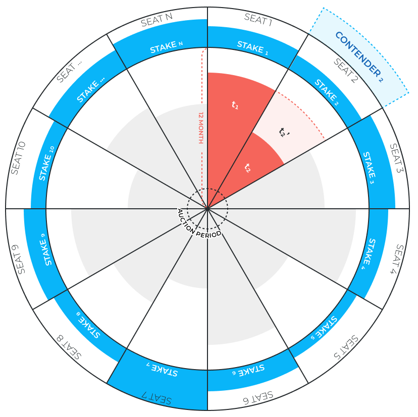

# Governance

Due to the decentralized nature, blockchain protocols typically have no central governing entity. This requires independent individuals to participate in the maintenance, development and securing of the protocol and the network. 

Participants must be motivated to perform these important tasks, and cryptocurrency tokens are used to financially compensate them for their efforts. As such, the design of the token economic model is critical to sufficiently keep these individuals keen to maximize the security, growth, and success of the protocol. In addition, a clear and transparent governance process is also crucial for the success of the blockchain protocol. Lack of central authority means no decisions can be unilaterally made and implemented. Hence, network participants must have a structured approach to collaborating and achieving consensus on what, when, how, and by whom, changes need to be made.

## Council

**DEIP Council** is the main governance body of the DEIP Infrastructure.

### How to become a council member?

To become a council member, any account in the network has two options:

* participate in an auction  
* takeover a seat from someone 

Each seat is granted for 12 months and then is allocated for another staking competition. The initial 12 seats are allocated via the first staking competition. Every 12 months 3 more seats in the Council will be created and allocated via staking competition. The total number of seats in the Council is limited to 30, therefore 6 years after the network launch all 30 seats will be allocated and the protocol will stop creating new ones. 

For those who’ve got a seat, their stake is being frozen for the next 12 months and unlocks gradually. 

## Council Member election: Staking Auction

Every year an election of Council members happens. An account that wants to become a Council member needs to stake a DEIP Token during the voting period. The top 12 accounts by staked amount receive a seat in DEIP Council. The staked amount is released over the period the member has a seat.

## Council Member election: Taking over a seat by contender

At any time any account can compete for a council seat by staking an amount $$CST_n$$ that is X times more \( $$X=>2$$\) than staked by the current stake $$ST_n$$ of the current council member. When this amount is staked, it reduces the time of the original owners of the seat by X times and accelerates the vesting schedule.

The account that competes for the seat is named **contender** and the stake \( $$CST_n$$\) this account uses for the competition reduces the time seat is reserved by a person by X times and accelerates vesting, where $$X_n=\frac{CSTn}{ST_n}$$ . The example of the Council state and contender model is illustrated in the Image _Council model, seat competition, and seat contender_. 

In the example, council seat number 2 has a contender with a stake two times more than the current seat owner \(council member\). The formula for the time remaining $$t_n$$ for the council member in case it has a contender is equal to:

$$
t_n = t_n^` \frac{ST_n}{CST_n}
$$

Therefore the final formula of time remaining $$t_n$$ for the council member n is equal:

$$
t_n = \frac {(t_{max}-(now-t_{n,init}))}{max(1_,\frac{CST_n}{ST_n})}
$$

## Ecosystem Fund \(Treasury\)

**DEIP Ecosystem Fund** is a DAO in the network governed by the Council. 


It accumulates a part of investment transaction fees to be further invested in F-NFT in the DEIP Infrastructure. 


The initial capital of the DEIP Ecosystem Fund is allocated during the TGE and consists of 25% of all issued DEIP Tokens. All funds of the Ecosystem Fund are vested over 10 years with 3 months lockup cliff period. The DEIP Council can invest the capital of the DEIP Ecosystem Fund in other assets in DEIP Infrastructure. The major investment purpose of the DEIP Ecosystem Fund is F-NFT issued in DEIP Infrastructure. Each investment decision must be approved by 2 council members to be processed. To liquidate a position 3 council members must approve the transaction. After the liquidation of a position, 20% of the profit goes to the council members who performed the initial investment transaction. The rest of the profit goes back to the DEIP Ecosystem Fund for further investment in F-NFTs.

