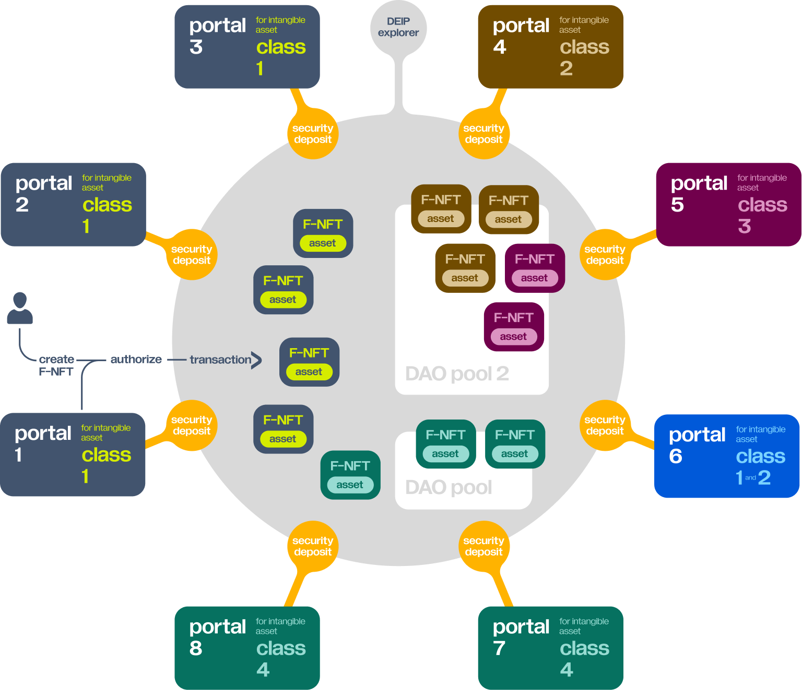

# Portals

## What are Portals?

**Portals** are gateways to DEIP infrastructure and provide all the necessary foundations \(e.g. user interface, off-chain data, regulation compliance, KYC/AML\) and services required to interact with the network. In order to simplify the creation of Portals and bring about further collaboration in the Web 3.0 environment, DEIP has created a special Constructor. 


Find out more about DEIP [Constructor](constructor.md). 


A Portal focuses on a specific **intangible asset class**, such as invention/patents, movie script, tokenized talent, etc. This allows each Portal to better address the needs of a specific customer segment, tune the Portal's UI and functionality to these needs, and even provide some additional functionality beyond the protocol. 

Portal owners are represented in the network as DAOs and their role in the protocol is as gatekeepers.

## Security deposit

Each Portal must fulfill specific requirements to ensure that the assets approved to be registered by a Portal have a high value and are authenticated. For this purpose, the incentive model of the protocol introduces a **security deposit** concept, which is designed to incentivize portals to register only high-value assets. 

Portals make security deposits by staking DEIP [tokens ](token.md)as a guarantee of the quality of assets they bring to the network. Each asset needs to satisfy minimum requirements according to the rules set by the Council. Portals can charge a **Portal fee** for asset registration in the network. This can be a one-time fee or an additional “curation fee” for a tokenized intangible asset and Portals earn a fee from all the future transactions from this asset.

## Portal Profitability Index \(PPI\)

For each Portal, the protocol calculates the **Portal Profitability Index \(PPI\)**, which is based on the **average CAGR** of all the assets registered through the Portal, the **average APY** of yield farmers from the segments, the **Portal address**, and **total aggregated revenue** from Portal fees for the last period. 

The **Portal Profitability Index \(PPI\)** provides transparency on the performance of the Portal, and therefore the performance of the assets registered by the Portal. If the **Portal Profitability Index \(PPI\)** of a specific Portal drops below a set threshold, a corresponding portion of the Portal security deposit is burned to compensate the network. This is one of the mechanisms designed to protect the network from low-value assets being registered by a Portal.

## Portal-specific smart contracts

Once the Portal is in operation for a while and has registered enough intangibles with total value above the threshold \(specific parameters like **min\_opration\_period, min\_assets\_registred, min\_assets\_registred\_total\_value** are set by the [Council](governance.md#council)\), it can also deploy Portal-specific smart contracts for yield farming, dynamic liquidity, and automated market maker \(AMM\) protocols. This allows for better price discovery and smart-contract risks assessment for assets registered by a specific portal. To do so it uses additional metadata and insights provided by the portal.

> For example, a yield-farming smart contract can provide for the sharing of part of the profit from the Portal fee or any other Portal revenue stream. This yield-farming smart contract can be customized for a specific asset class from this Portal and provide a better risk/profit profile for potential yield farmers.

Custom automated market maker \(AMM\) smart contracts can be restricted to the assets just registered from the Portal and provide better terms for asset holders or liquidity pool providers.

