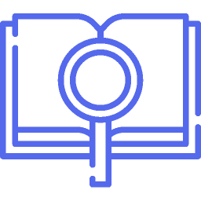

# DAOs

DAO stands for **decentralized autonomous organization**.

Implemented as a smart contract in a public blockchain, a DAO operates according to programmed rules as opposed to being controlled by executives in an organization. DAOs run without a central authority and all the rules of the organization are enforced by code running in a blockchain. 

Furthermore, DAOs often manage their own treasury and issue their own tokens. These tokens represent the membership, voting rights, and/or ownership of the DAO. DAOs can perform similarly to traditional organizations such as corporations, cooperatives, non-profits, etc.

In the DEIP Network, any registered user can create and operate DAOs to co-own and co-manage F-NFTs and other assets. DAOs can be used to create F-NFT pools and F-NFT funds. A DAO itself can be tokenized and DAO tokens can be allocated to multiple accounts. DAO tokens can have both governance and voting rights, and also allow to claim a share of profit from a specific DAO or F-NFT pool. DEIP Council and yield farming can also be considered as special DAOs for network governance.

 You may also find these articles helpful: 







