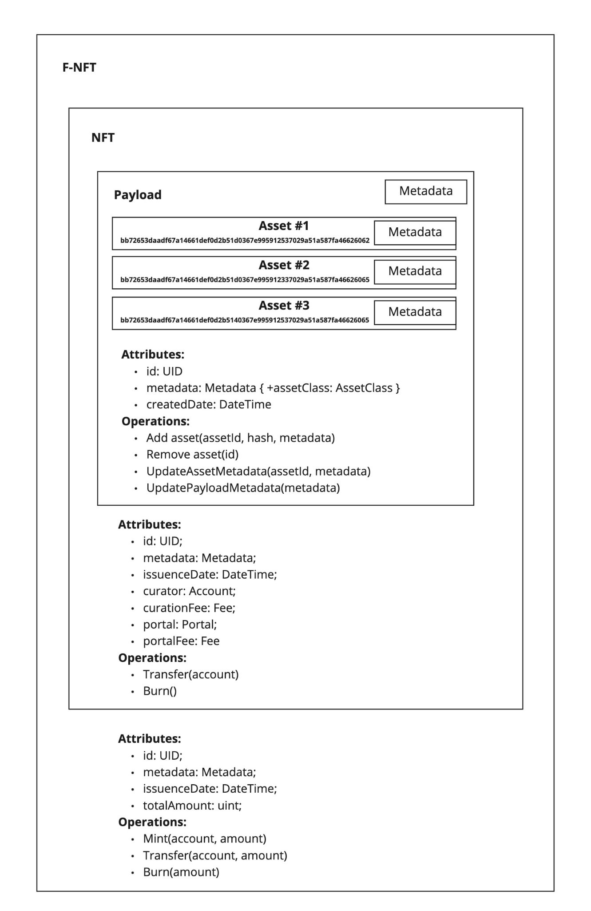

# Tokenized intangible assets

Intangible assets are the core assets for DEIP infrastructure and need to be represented in such a way that the Creator Economy Protocol can work with them. Web 3.0 space introduces a relevant concept for this purpose: a non-fungible token or NFT. Every intangible asset is unique and it perfectly fits the concept of NFT.


The Creator Economy Protocol expects that every intangible asset \(or pool of intangible assets\) is tokenized and makes is possible to own a **fraction** of this asset. Tokenization makes it possible to apply various decentralized finance and governance instruments, and for the Creator Economy Protocol to boost the liquidity of intangible assets.


## What is F-NFT?


F-NFT stands for a Fractionalized Non-Fungible Token \(NFT\). You can think of it as an NFT combined with an ERC-20 token. For example, to create an F-NFT on the Ethereum network some protocols actually do combine ERC-721 and ERC-20 tokens, or use the ERC-1155 standard.


**F-NFTs** \(fractionalized non-fungible token\) are used in the DEIP Network to boost the liquidity of intangible assets. The Creator Economy Protocol makes is possible to tokenize individual intangible assets or pools of intangible assets, and then issue fractions of the tokens \(F-NFT\) and distribute them among multiple holders. 

Governance of F-NFT and underlying intangible assets is performed using DAOs or individual accounts in the network. A simple DAO can be implemented as a multi-signature account with a votes threshold required to operate. Various other DAO governance models can be implemented and plugged in. __

### Benefits

| Benefit | Definition |
| :--- | :--- |
| **Price discovery** | One of the main benefits of F-NFT is price discovery via transactions on the secondary market. Every time a fraction of an F-NFT is sold in the DEIP Network, it effectively sets the actual price of the whole asset. The price of the assets can be used by smart contracts in the network. For example, it is extremely useful for synthetic assets in case the underlying asset is F-NFT or a pool of F-NFTs. |
| **Liquidity** | Asset owners achieve significantly better exit liquidity than in case they own the NFT themselves. This is achieved through on-chain exchanges and liquidity protocols. |
| **Governance** | Because control over the F-NFT is spread over a potentially big number of stakeholders, NFT “rights” such as revenue sharing and voting become tangible concepts, and various models for tokenized asset governance emerge.  [Read more about governance](../governance.md) |

### Components 

| Component | Definition |
| :--- | :--- |
| **Asset authentication** | Each asset — whether it’s an invention, a film script, or any other high-value digital asset — needs to be verified for authenticity. Once verified, the record will be stored on-chain for any other party to check. |
| **Fractionalization smart contract** | This contract allows the creator and owner of the asset to specify the token properties or metadata, including the number of tokens to create and how and to whom to initially distribute ownership. |
| **F-NFT listing** | This function lists an F-NFT on the exchange and provides a common exchange functionality such as order books, matching, and selling/buying of the token. The F-NFT listing also contributes to full transparency and informs holders of new ownership or rights repartition of the asset. Since it is a Polkadot Parachain, DEIP Network enables additional liquidity from other Polkadot Parachains, for example, DEXs and liquidity pools. |

DEIP focuses on the tokenization of intangible assets with significant underlying value. We strongly believe that these types of assets will not only be very popular among the crypto investor community, but will also bring new users to the Web 3.0 ecosystem, thus driving adoption.

### Royalty distribution

Tokenized intangible assets generate revenue, and most of the time the revenue is generated from selling the licensing rights to third parties and from curation fees. Since licensing and curation are both implemented in the Creator Economy Protocol, it is possible to automate the distribution of royalties between token holders. For each royalty distribution transaction, a DEIP Network fee is paid, which is then distributed between the Ecosystem Fund and yield farmers. This distribution model is called **automated royalty distribution**. 

### Governance

In the DEIP Network, any registered user can create and operate a DAO to co-own and co-manage F-NFTs and other assets. DAOs can also be used to create F-NFT pools and F-NFT funds. A DAO itself can be tokenized and DAO tokens can be allocated to multiple accounts. DAO tokens can have both governance and voting rights, and also allow to claim a share of profits from a specific DAO or F-NFT pool. A DEIP Council and yield farming can also be considered as special DAOs for network governance.


DAO stands for a Decentralized Autonomous Organization. Implemented as a smart contract in a public blockchain, a DAO operates according to the programmed rules as compared to being controlled by executives in an organization. DAOs run without a central authority and all the rules of the organization are enforced by the code running in a blockchain. Furthermore, DAOs often manage their own treasury and issue tokens. The tokens issued represent the membership, voting rights, and/or ownership of the DAO. DAOs can perform similarly to traditional organizations such as corporations, cooperatives, non-profits, etc.


