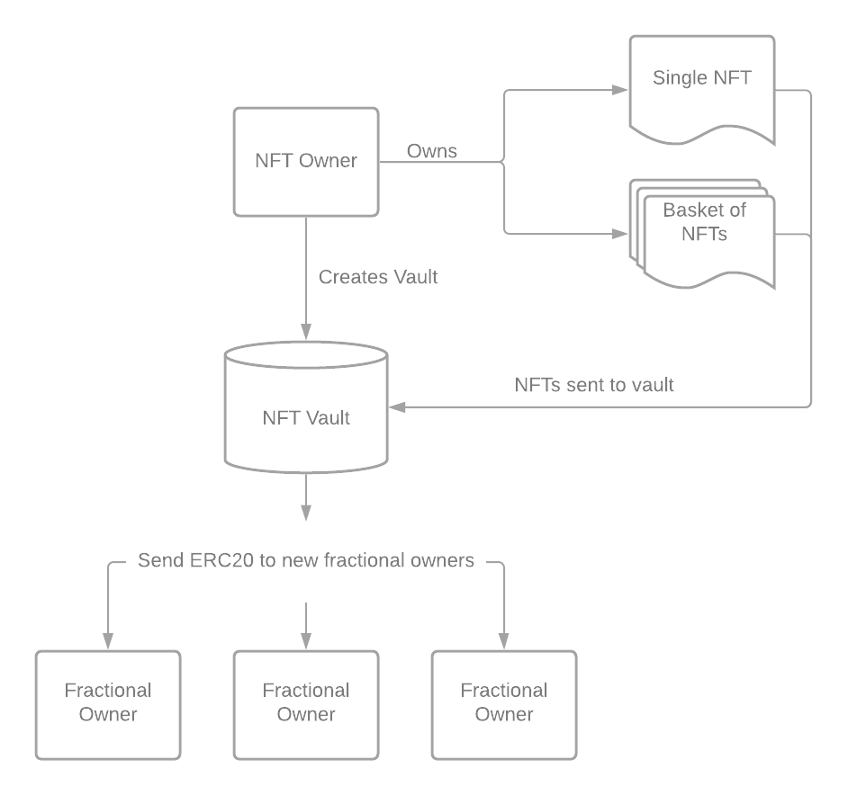

# Tokenized intangible assets \(F-NFTs\)

Intangible assets are the core assets for the DEIP Infrastructure, therefore they must be represented in such a way that Intellectual Capital Protocol can work with them. Web3 space introduces a relevant concept for this purpose - a non-fungible token or NFT. Every intangible asset is unique and it perfectly fits the concept of NFT. Intellectual Capital Protocol expects that every intangible asset \(or pool of intangible assets\) is tokenized and it is possible to own a fraction of this asset. Only in this case, it makes it possible to apply various decentralized finance and governance instruments and Intellectual Capital Protocol to boost the liquidity of intangible assets.

## Fractionalized Non-Fungible Token

F-NFT is used in the DEIP Network to tokenize intangible assets on the blockchain. For each intangible asset or bucket/pool of intangible assets, it is possible to issue an F-NFT and distribute it among multiple holders. F-NFT has a set of operations to perform with this token and with the underlying assets. Each operation can have a separate governance mechanism. Usually, governance of F-NFT and underlying intangible assets is performed using DAOs or individual accounts in the network. Simple DAO can be implemented as a multi-signature account with a votes threshold required to perform the operation. Various other DAO governance models can be implemented and plugged in. __


F-NFT stands for a Fractionalized Non-Fungible Token \(NFT\). You can think of it as an NFT combined with an ERC-20 token. For example, to create an F-NFT on the Ethereum network some protocols actually do combine ERC-721 and ERC-20 tokens, or use the ERC-1155 standard.


### F-NFT Components 

| Component | Definition |
| :--- | :--- |
| **Asset Authentication** | Each asset whether it’s an invention, a film script, or any other high-value digital asset would need to be verified for authenticity. Once verified the record will be stored on-chain for any other party to reference. |
| **Fractionalization Smart Contract** | It allows the creator and owner of the asset to specify the token properties or metadata, including the number of tokens to create and how and to whom to initially distribute ownership. |
| **F-NFT Listing** | This function lists the F-NFT on the exchange and provides a common exchange functionality such as order books, matching, and selling/buying of the token. It also provides full transparency and informs the owners of the new ownership or rights repartition on the asset. DEIP Network as a Polkadot Parachain enables additional liquidity from other Polkadot Parachains, for example, DEXs and liquidity pools. |

### F-NFT Benefits

| Benefit | Definition |
| :--- | :--- |
| **Price Discovery** | One of the main benefits of F-NFT is price discovery via transactions on the secondary market. Every time a fraction of an F-NFT is sold in the DEIP Network it effectively sets the actual price of the whole asset. The price of the assets can be used by smart contracts in the network. For example, it is extremely useful for synthetic assets in case the underlying asset is F-NFT or a pool of F-NFTs. |
| **Liquidity** | Asset owners achieve significantly better exit liquidity than in case they own the NFT themselves. This is achieved through on-chain exchanges and liquidity protocols. |
| **Governance and Rights** | As control over the F-NFT is spread over a potentially big number of stakeholders, NFT “rights” such as revenue sharing and voting become tangible concepts, and various models for tokenized assets governance emerge. Find more details on the governance of F-NFTs in the DEIP Network in the “DAOs and governance of tokenized assets” section. |

DEIP focuses on the tokenization of intangible assets with significant underlying value. We strongly believe that these types of assets will not only be very popular among the crypto investors community but will also bring new users to the Web3.0 ecosystem thus driving the adoption.

## Automated royalty distribution

Intangible assets can generate revenue. Most of the time the revenue is generated from selling the licensing rights to third parties and from curation fees. Since licensing and curation are both implemented in the Intellectual Capital Protocol, it makes possible to automate the distribution of royalties between token holders. For each royalty distribution transaction, a network fee is paid and further distributed between the Ecosystem Fund and Yield farmers.

## DAOs and governance of tokenized intangible assets


DAO stands for a Decentralized Autonomous Arganization. Implemented as a smart contract in a public blockchain, a DAO operates according to the programmed rules as compared to being controlled by executives in an organization. DAOs run without a central authority and all the rules of the organization are enforced by the code running in a blockchain. Furthermore, DAOs often manage their own treasury and issue their own tokens. These tokens represent the membership, voting rights, and/or ownership of the DAO. DAOs can perform similarly to traditional organizations such as corporations, cooperatives, non-profits, etc.


In the DEIP Infrastructure, any registered user can create and operate DAO to co-own and co-manage F-NFTs and other assets. DAO can be used to create F-NFT pools and F-NFT funds. DAO itself can be tokenized and DAO tokens can be allocated to multiple accounts. DAO tokens can have both governance and voting rights, and also allow to claim a share of profit from a specific DAO or F-NFT pool. A DEIP Council and yield farming can also be considered as special DAOs for network governance.

