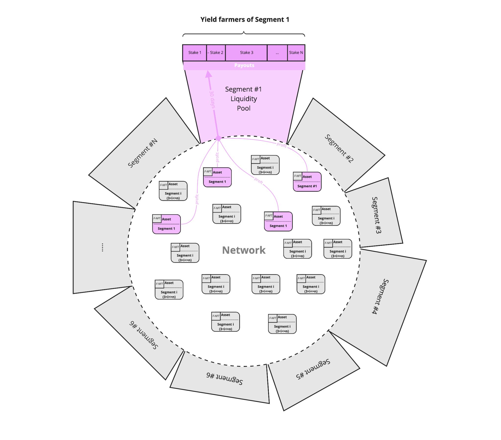

# Yield farming

The Decentralized Finance \(DeFi\) movement has been at the forefront of innovation in the blockchain space. What makes DeFi applications unique? They are permissionless, meaning that anyone \(or anything, like a smart contract\) with an Internet connection and a supported wallet can interact with them. In addition, they typically don’t require trust in any custodians or middlemen. In other words, they are trustless. 


One of the new concepts that have emerged is **yield farming**. It’s a new way to earn rewards with cryptocurrency holdings using permissionless liquidity protocols. It allows anyone to earn passive income using the decentralized ecosystem. Yield farming also referred to as liquidity mining, is a way to generate rewards with cryptocurrency holdings. In simple terms, it means locking up cryptocurrencies and getting rewards.


## How it works in DEIP Infrastructure?

Each F-NFT has **metadata** in DEIP Infrastructure. One of the metadata attributes is a **category/segment** of an underlying intangible asset. 

> It can be for example “technology” category, and the sub-category “biotech” or “nano-tech” or “environmental-tech”.

Every account in the network can stake **DEIP Token** on a specific category to increase the amount of funding allocated from the **Ecosystem Fund** to a specific category of F-NFT. The distribution of capital allocation in the Ecosystem fund is proportional to the amount of stacked DEIP Tokens for each specific category. 

Since every F-NFT also has a metadata attribute that specifies the platform it is issued on, it’s also possible to stake DEIP Tokens to change the distribution of capital allocated for each issuance platform. After network participants staked their tokens, the Ecosystem Fund will have a special allocation to spend on investments in specific issuance platforms. By default, 5% of the profit from the Ecosystem Fund investment activities will be distributed among those who staked in the category which gained this profit.

It creates an incentive to stake DEIP Tokens in categories/segments of F-NFT which will generate the most profits. On another hand, the Council investment decisions and the eventual distribution of capital can be different from the distribution staked by F-NFT Segments Staking. The difference tells us who was better in investment decisions - the Council or the Community of yield farmers. If the performance of the Community is better by {delta} then the next allocation of the DEIP Ecosystem Fund for the community-driven investments will be increased. The starting percentage of allocated capital for community-driven investment decisions is 20% and can’t drop lower than this value, and can’t grow higher than 80%.

Profit from yield farming $$P_{ki}$$ for an account i from all accounts \[1,N\] staked stakes $$ST_i$$ with a total amount $$ST$$ total on a segment $$k$$ is calculated with the next formula:

$$
P_{ki} = \frac{ST_{ki}*\underset{d=day(now)-30}\Sigma P_{kd}}{\sum_{j=1}^{j=N}{ST_{kj}}}
$$

### Segment Liquidity Pools and AMM

At some point after the network launch when each segment has a considerable amount of DEIP Tokens staked on it, the Protocol will be updated to convert DEIP Tokens staked on a specific segment of assets into a **Segment Liquidity Pool** \(SLP\). Once SLP is introduced, it will enable additional liquidity for the assets in this segment via automatic market making. An **automated market maker** \(AMM\) is a type of decentralized exchange \(DEX\) protocol that relies on a mathematical formula to price assets. Instead of using an order book like a traditional exchange, assets are priced according to a pricing algorithm.

